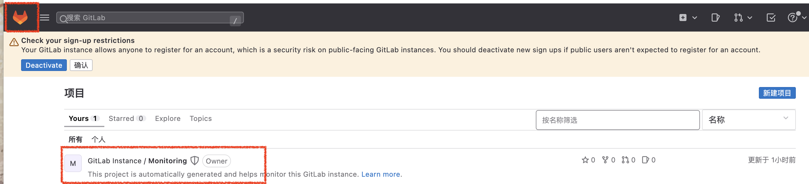
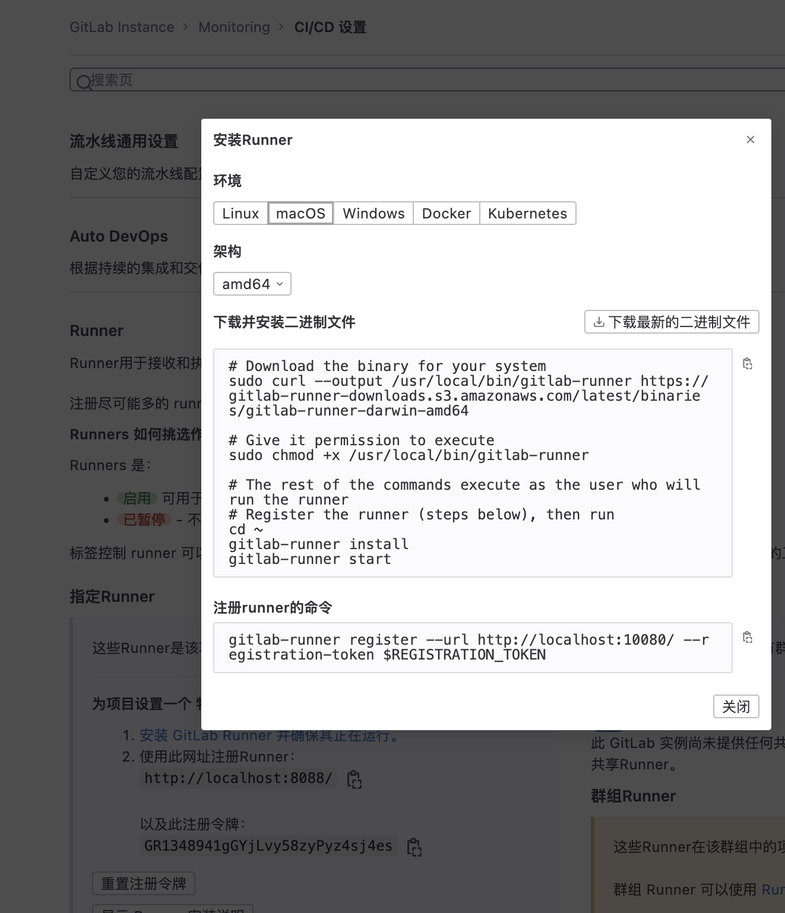
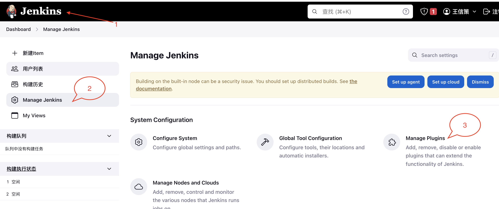

# 安装 docker

- brew install --cask docker
- 如果有问题直接去官网用安装包安装
- 然后打开这个应用

# gitlab

- 安装与启动

```shell
# 新建一个 docker-compose.yml 文件

# 复制 https://github.com/sameersbn/docker-gitlab/blob/master/docker-compose.yml 内容到这个文件

# 更换自己的相关信息 编辑 docker-compose.yml 文件

- GITLAB_HOST=公网地址
- GITLAB_ROOT_PASSWORD=管理员密码
- GITLAB_ROOT_EMAIL=管理员邮箱
- GITLAB_PORT=8088
# 避免后续gitlab-runner git clone 失败
# 必须为本地地址
- GITLAB_HOST=IP地址
 ports: //映射端口
      - '8088:80'
      - '2443:443'
      - '2222:22'
# 这个文件路径终端执行 docker-compose up 启动服务

# 登录页面
http://localhost:8088
账号密码是 docker-compose.yml 文件里面定义的
```

- 切换中文


- 克隆一个默认仓库

```js
http://localhost:8088/gitlab-instance-eeae81df/Monitoring.git
yarn create umi
```



- 初始化仓库

```js
yarn create umi
git add .
git commit -m 'chore: init Project';
```

- 项目根目录新建 .gitlab-ci.yml
- 同时需要 Dockerfile nginx.conf 文件 参考仓库即可

```js
stages:
  # 编译阶段
  - build
  # 部署阶段
  - public

online_deploy:
  # 手动执行
  when: manual
  # 触发分支
  # #
  only:
    - main
    - develop
    - /^hotfix_.+/
  # 所属的阶段
  stage: public
  # tag
  tags:
    # 执行的命令
    - demo-tag
  script:
    - docker build -t monitoring:${CI_COMMIT_SHORT_SHA} -f Dockerfile . || echo 'docker build error'
    - docker save -o /monitoring.tar monitoring:${CI_COMMIT_SHORT_SHA}
    - docker load -i /monitoring.tar; docker stop \$(docker ps -f 'label=dpmonline' -q);
```

- 安装 Runner

```dockerfile
# 不要使用docker  里面缺少java环境  直接使用安装包
# http://localhost:8088/gitlab-instance-eeae81df/Monitoring/-/settings/ci_cd#js-runners-settings
# 在这个页面按照步骤操作即可

# Download the binary for your system
sudo curl --output /usr/local/bin/gitlab-runner https://gitlab-runner-downloads.s3.amazonaws.com/latest/binaries/gitlab-runner-darwin-amd64

# Give it permission to execute
sudo chmod +x /usr/local/bin/gitlab-runner

# The rest of the commands execute as the user who will run the runner
# Register the runner (steps below), then run
cd ~
gitlab-runner install
gitlab-runner start


# 如果报错
gitlab-runner uninstall
gitlab-runner install
gitlab-runner start
```



- 注册 Runner

```dockerfile
# 注意tag-list要和 .gitlab-ci.yml 指定的 tags 相同
sudo gitlab-runner register \
  --non-interactive \
  --tls-ca-file=/etc/gitlab/ssl/gitlab.example.com.crt  \
  --url "http://localhost:8088/" \
  --registration-token "GR1348941MQCEkL4bB2szz2YoUFxu" \
  --executor "shell" \
  --docker-image maven:latest \
  --description "docker-ruby:2.6" \
  --tag-list "demo-tag" \
  --run-untagged \
  --locked="false"
# 手动验证及启动
sudo gitlab-runner verify
sudo gitlab-runner run
```

- runner 流水线触发时无法 clone 仓库

```js
# 需要将 gitlab localhost 变成 ip地址

/home/git/gitlab/config/gitlab.yml
# before
  gitlab:
    host: localhost
# after
    gitlab:
    host: 192.168.1.5
# docker 镜像里面没有vim
apt-get update
apt-get install vim
```

- runner 添加 docker 支持

```js
 # cd ~/.gitlab-runner/config.toml
    image = "docker:latest"
    volumes = ["/var/run/docker.sock:/var/run/docker.sock", "/cache"]
```

- docker 管理员权限问题

```js
"features": {
    "buildkit": false
  }
```


- 构建流水线成功


# jenkins

- 安装与启动

```shell
# 安装jenkinx
docker run -itd -u root -p 8080:8080 -v jenkins-data:/var/jenkins_home -v /var/run/docker.sock:/var/run/docker.sock -v "$HOME":/home --name jenkins jenkins/jenkins

# 查看初次登录密匙
docker logs jenkins

# 登录界面
http://localhost:8080/

## 输入密匙

## 选择默认推荐的插件安装

## 按照新手入门配置自己一些默认配置
```

- 配置

```markdown
# 1. 添加 CDN

https://updates.jenkins.io/update-center.json
https://mirrors.tuna.tsinghua.edu.cn/jenkins/updates/current/update-center.json
```




- 需要安装的必备插件

```
Authorize Project
GitHub Integration
GitLab
Publish Over SSH
SSH Agent
SSH
SSH Pipeline Steps
```


## jenkins 触发 gitlab 流水线

```markdown
新建任务
jenkins-demo
自由风格
源码管理
构建触发器
//填写到 gitlab 集成 url
build when a change is pushed to gitLab
选中 push event
opened merge Request events
approved merge request(ee-only)
comments
comment for triggering a build
```

## Jenkinsfile

```markdown
pipeline {
agent {
docker {
image 'node:10'
args '-p 20000:8080'
}
}

    stages {
        stage('Build') {
            steps {
                echo 'Building..'
                sh 'node -v'
                sh 'echo "hello"'
            }
        }
        stage('Test') {
            steps {
                echo 'Testing..'
            }
        }
        stage('Deploy') {
            steps {
                echo 'Deploying....'
            }
        }
    }

}
```

## 问题

```markdown
// jenkins 和 gitlab 在一个服务器上
管理中心
设置
网络
外发请求
选中 allow requests ...
```
